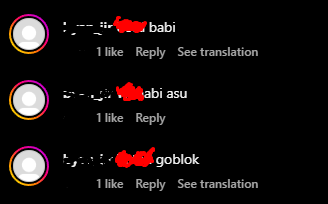

<!-- Improved compatibility of back to top link: See: https://github.com/othneildrew/Best-README-Template/pull/73 -->

<a name="readme-top"></a>

<!--
*** Thanks for checking out the Best-README-Template. If you have a suggestion
*** that would make this better, please fork the repo and create a pull request
*** or simply open an issue with the tag "enhancement".
*** Don't forget to give the project a star!
*** Thanks again! Now go create something AMAZING! :D
-->

<!-- PROJECT SHIELDS -->
<!--
*** I'm using markdown "reference style" links for readability.
*** Reference links are enclosed in brackets [ ] instead of parentheses ( ).
*** See the bottom of this document for the declaration of the reference variables
*** for contributors-url, forks-url, etc. This is an optional, concise syntax you may use.
*** https://www.markdownguide.org/basic-syntax/#reference-style-links
-->

<!-- [![Contributors][contributors-shield]][contributors-url]
[![Forks][forks-shield]][forks-url]
[![Stargazers][stars-shield]][stars-url]
[![Issues][issues-shield]][issues-url]
[![MIT License][license-shield]][license-url] -->

<!-- PROJECT LOGO -->
<br />
<div align="center">
  <a href="https://github.com/alfanzain/instagram-toxic-antidote">
    
  </a>
  <br />Note: it's just random example. It's not mine. Trust me.

  <h3 align="center">Instagram Toxic Antidote</h3>

  <p align="center">
    I just feel ashamed about my comments recently. I don't want my friends or recruiters find my silly comments. But I don't have much time to delete it all. So, I built this.
    <br />
    <br />
    <a href="https://github.com/alfanzain/instagram-toxic-antidote/issues">Report Bug</a>
    ·
    <a href="https://github.com/alfanzain/instagram-toxic-antidote/issues">Request Feature</a>
  </p>
</div>

<!-- TABLE OF CONTENTS -->
<details>
  <summary>Table of Contents</summary>
  <ol>
    <li>
      <a href="#about-the-project">About The Project</a>
      <ul>
        <li><a href="#built-with">Built With</a></li>
      </ul>
    </li>
    <li>
      <a href="#getting-started">Getting Started</a>
      <ul>
        <li><a href="#prerequisites">Prerequisites</a></li>
        <li><a href="#installation">Installation</a></li>
      </ul>
    </li>
    <li><a href="#usage">Usage</a></li>
    <li><a href="#roadmap">Roadmap</a></li>
    <li><a href="#contributing">Contributing</a></li>
    <li><a href="#license">License</a></li>
    <li><a href="#contact">Contact</a></li>
    <li><a href="#acknowledgments">Acknowledgments</a></li>
  </ol>
</details>

<!-- ABOUT THE PROJECT -->

## About The Project

I am toxic.

I **WAS** toxic.

I spread toxic comments.

But, I want to repent.

I feel guilty.

I need to delete all my toxic track records.

I need the antidote.


Please don't use this as illegal actions.

<p align="right">(<a href="#readme-top">back to top</a>)</p>

### Built With

-   Javascript

<p align="right">(<a href="#readme-top">back to top</a>)</p>

<!-- GETTING STARTED -->

## Getting Started

### Prerequisites

-   Google Chrome browser

### Installation

_Below is an example of how you can instruct your audience on installing and setting up your app. This template doesn't rely on any external dependencies or services._

1. Clone the repo
    ```sh
    git clone https://github.com/alfanzain/instagram-toxic-antidote.git
    ```
2. Open Chrome browser, go to chrome://extensions/
3. Turn on _Developer Mode_
4. Load `instagram-toxic-antidote` extension by using _Load Unpacked_

<p align="right">(<a href="#readme-top">back to top</a>)</p>

<!-- USAGE EXAMPLES -->

## Usage

1. Go to [your Instagram comment activity](https://www.instagram.com/your_activity/interactions/comments)
2. You can filter your comments first
3. Click this `instagram-toxic-antidote` extension
4. Click **Antidote!** button

<p align="right">(<a href="#readme-top">back to top</a>)</p>

<!-- ROADMAP -->

## Roadmap

-   [ ] Add changelog
-   [ ] Add pause feature
-   [ ] Skip undeletable comment (blocked account)
-   [ ] Delete only disgusting comment (filter by specific words, harsh words, sexual words)
-   [ ] Auto filter comments by Start and End Date

See the [open issues](https://github.com/alfanzain/instagram-toxic-antidote/issues) for a full list of proposed features (and known issues).

<p align="right">(<a href="#readme-top">back to top</a>)</p>

<!-- CONTRIBUTING -->

## Contributing

Contributions are what make the open source community such an amazing place to learn, inspire, and create. Any contributions you make are **greatly appreciated**.

If you have a suggestion that would make this better, please fork the repo and create a pull request. You can also simply open an issue with the tag "enhancement".
Don't forget to give the project a star! Thanks again!

1. Fork the Project
2. Create your Feature Branch (`git checkout -b feature/AmazingFeature`)
3. Commit your Changes (`git commit -m 'Add some AmazingFeature'`)
4. Push to the Branch (`git push origin feature/AmazingFeature`)
5. Open a Pull Request

<p align="right">(<a href="#readme-top">back to top</a>)</p>

<!-- LICENSE -->

## License

Distributed under the MIT License. See `LICENSE` for more information.

<p align="right">(<a href="#readme-top">back to top</a>)</p>

<!-- CONTACT -->

## Contact

Alfan Zain - [@alfanzainkp](https://twitter.com/alfanzainkp) - alfanzainkp@gmail.com

Project Link: [https://github.com/alfanzain/instagram-toxic-antidote](https://github.com/alfanzain/instagram-toxic-antidote)

<p align="right">(<a href="#readme-top">back to top</a>)</p>

<!-- ACKNOWLEDGMENTS -->

## Acknowledgments

-   [Best-README-Template](https://github.com/othneildrew/Best-README-Template)

<p align="right">(<a href="#readme-top">back to top</a>)</p>

<!-- MARKDOWN LINKS & IMAGES -->
<!-- https://www.markdownguide.org/basic-syntax/#reference-style-links -->

[license-shield]: https://img.shields.io/github/license/othneildrew/Best-README-Template.svg?style=for-the-badge
[license-url]: https://github.com/othneildrew/Best-README-Template/blob/master/LICENSE.txt
